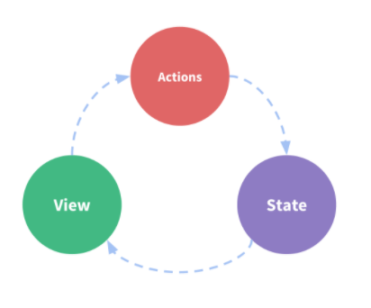
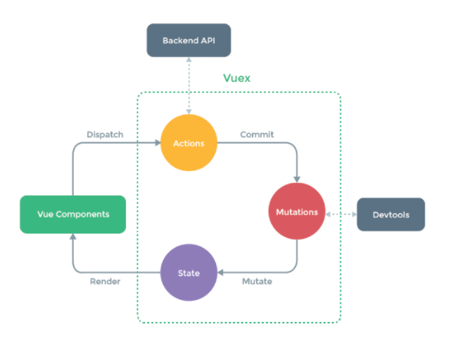

# Vuex

> 상태를 전역 저장소로 관리할 수 있도록 하는 라이브러리

- [공식문서](https://vuex.vuejs.org/kr/)

- `중앙 집중식 저장소`
-  State(상태) : data(데이터)를 뜻함
- 기존의 데이터관리방식(props & emit)을 해결하기 위해서 Vuex 사용
  - props & emit : 각 컴포넌트가 독립적으로 데이터를 관리
    - 장점 : 데이터 흐름을 직관적으로 파악가능
    - 단점 : 한단계식 진행해야하므로 비효율적이다

- 단방향 데이터 흐름
  - View(화면)
  - action : 데이터 수정(methods)
  - state : data
  - 

- 구성요소
  - state
  - Actions
    - Component에서 `dispatch()` 메서드로 Actions호출
    - 항상 context가 인자로 넘어옴
    - 비동기 작업
  - Mutations
    - ACtions에서 `commit()` 메서드로 호출
    - 첫번째 인자로 state가 넘어옴
    - 동기적인 작업
  - Getters(computed와 유사)
    - state를 기준으로 계싼
  - 

- 순서

  1. components에서 dispatch로 함수호출 -> actions

     ```javascript
     // ex
     createTodo: function () {
         this.$store.dispatch('createTodo', this.todo)
     }
     ```

  2. actions 에서 commit 하기 -> mutations

     ```javascript
     // ex
     createTodo: function ({commit}, todoItem) {
         commit('CREATE_TODO', todoItem)
     }
     ```

  3. mutations에서 push하기 -> state

     ```javascript
     // ex
     CREATE_TODO: function (state, todoItem) {
         state.todos.push(todoItem)
     }
     ```

  4. state의 변수확인

